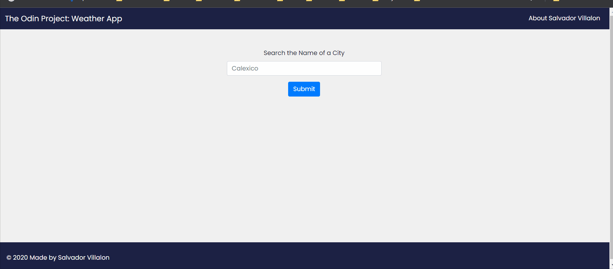

# Weather App
[The Odin Project: Javascript] - Project: Weather App

# Summary
Created a Weather App! Enter the city name and it will show the humidity, wind, Fahrenheit, Celsius, and the condition of the sky currently happening in the city
- Project Task: [The Odin Project - Weather App](https://www.theodinproject.com/lessons/node-path-javascript-weather-app)
- View Project: https://salvillalon45.github.io/theOdinProject-WeatherApp/

### Implementation 
- Built using Vue.js. Used async/await to fetch data from the Open Weather Map API
- Developed with JavaScript factory functions to organize code

### Demo

### 📗 Fonts used

-   [Poppins](https://fonts.google.com/specimen/Poppins?query=Poppins)

# Technologies:
  - Vue.js
  - Surge.sh
  - JavaScript
